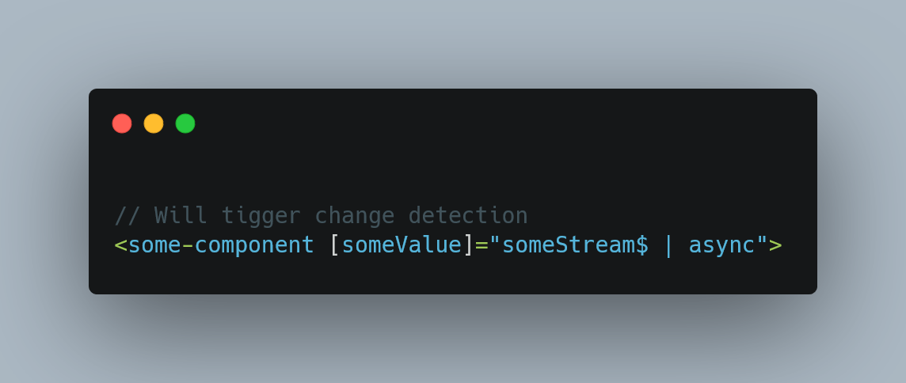

# Modern Angular

It's not about using the latest features, running on the bleeding edge.
Instead, it's about **not clinging to the old ways** of doing things and **not jumping on new trends** before the become **best practices**.

## Key elements

We can break "modern" angular down to these key elements:

- State Management
- OnPush change detection
- Coding reactively
- Smart/Dump components
- Standalone/SCAM components
- Collocating code

## State Management

What is `state`?

State is something that is part of our application, such as:

* a list of customers, or a list of products coming from some backend
* which language is selected?
* which languages are available?

What is `State Management` then?

> A desgin patter which synchronizes the state of our application throughout all of our components.


There should be a single source of truth for the state of our application. Without state management, the state is distributed and scattered around individual components. 

Popular choices for State Management:

* [NgRx](https://ngrx.io/)
* [NGXS](https://www.ngxs.io/)
* [Service with a Subject](https://blog.angular-university.io/how-to-build-angular2-apps-using-rxjs-observable-data-services-pitfalls-to-avoid/)

## OnPush change detection

By default, Angular will use `zone.js` for change detection. It patches **all DOM events** which might cause changes to trigger Angulars change detection.

OnPush change detection on the other hand only runs change detection when:

1) A reference to a value changes


2) An event binding is triggered


3) Async pipe emits a new value:



Yes, this does increase the performance of our apps - significantly. But we shouldn't care about it unless performance is an issue.

We want this because in order **to work with these restrictions** of change detction, **we need to architect our application better**.

Which falls right into the next two categories:

- Smart/Dump components
- Coding reactivly

Because on of the change detection triggers is `the input to a component changing` it encourages us to break up our applications ino smaller (idealy single responsibility) components.

If our components do too much, it might be harder (or awkward) to trigger change detection. With smaller components, we'll have fewer problems with onPush change detection.

It also encourages us to code reactivly and **use the async pipe**!

## Smart and Dump components

With this approach we want to break our components up into two categories: Smart and Dump components.

Smart componentes are typically our routed components (the target of a route). The are `smart` because:

- They know things about the application
- They inject services and orchestrate data flowing into their child, dump components

Dump (or presentational) components are dump, becuase they don't need to understand the context in which they are used.

They: 

- Primarily just receive inputs and communicate back to the parent component using outputs
- Generally don't inject any dependencies

This is great to adhere to the single responsibility princible and it also makes the components very modular.

Since they are context independent, they are easy re-usable: either within the application or even among multiple different applications.

## Coding reactivly

Requires the highest learning investment.

What coding reactively in Angular looks like - specifically `reified reactivity` - is something like this:

We have a stream and that controls what happens to the data flowing through it.


We have data entering the stream at the `Source`. This could be through a service or the result of an http request.

That data flows through, **in an unbroken stream** to the exit or `Sink`, which is typically the template, where we want to display that data. 


The key point is, that through this entire journey **we never manually subscribe** to the stream.


**We only subscribe to the stream** when we want to pull the data out when we reach the destination - which is often the template.

If the subscribe, we are breaking this **unbroken stream from the source to the sink** and we loose a lot of the benefits.

This doesn't mean we can never manually subscribe to an observable, but if we do it just means were aren't coding reactivly anymore.

Main benefits:

- If everything is based off streams, whenever any data changes, everything updates automatically whereever it needs to
- It makes dependencies very clear. Data is not modified in surprising ways, it can be followed from the source to the sink

**TODO:** Go into more details, especially the benefits. Show how we normally would have to keep up with changes.

## Standalone / SCAM

What is it?

A standalone component doesn't have to be declared in any module (available in ng 14+).


A SCAM (single component angular module) is the earlier alternative:


The key idea is to **focus less on the modules** and **focus more on the components** as the building blocks of an angular application instead.

Just use whatever you need  wherever you need it, instead of worring how best to group things together.


## Colocating code

Nx inspired style structure where **the application is broken up into features**. Each feature generally has three folders:

```
feature
- data-access
- ui
- utils
- feature.component.ts
```

The `feature-component` itself will be the smart (routed) component.

Anything related to managing data, like `services` and `stores`, will be in the `data-access` folder.

The `ui` folder will hold the `dump components` and the feature specific `directives`.

Other `helpers` and `utils` will live in the `utils-folder`.

The key idea is that **all the code related to a particular feature is grouped closely together**, which makes it easier to build and maintain.

For code that is shared among multiple feature, there is a `shared folder` which also includes data-access, ui and utils folders within it.

So rather than having a `services` folder which holds all the services for every feature in the application, the services related to a specific feature are located inside the folder for this specific feature.

## Summary

TODO

## TODOs

- Bring in State-Management


## References

### Joshua Morony

* [WTF is "modern" Angular development?](https://youtu.be/36G-ZFcllkk)
* [Why you should care about DECLARATIVE programming](https://youtu.be/Fr9e9Fo6iMw)
* [How to handle modals "declaratively/reactively" with Angular (and is it any better?)](https://youtu.be/vh4WLrqGPEQ)
* [The easier way to code Angular apps](https://youtu.be/skOTEbGwncE)
* [WTF is "Zone.js" and is it making your app slow?](https://youtu.be/lmrf_gPIOZU)


---

[Previous](./29.md)