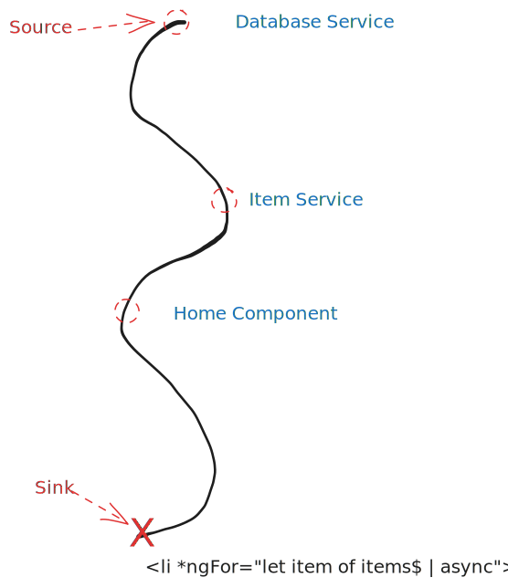

We have data entering the stream at the `Source`. This could be through a service or the result of an http request.

That data flows through, **in an unbroken stream** to the exit or `Sink`, which is typically the template, where we want to display that data. 

[Previous](./16.md) [Next](./18.md)