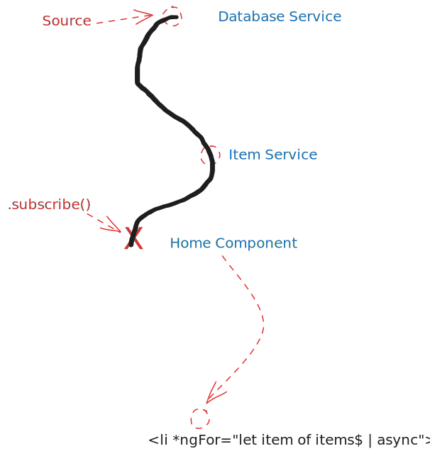

The key point is, that through this entire journey **we never manually subscribe** to the stream.

**We only subscribe to the stream** when we want to pull the data out when we reach the destination - which is often the template.

[Previous](./17.md) [Next](./19.md)